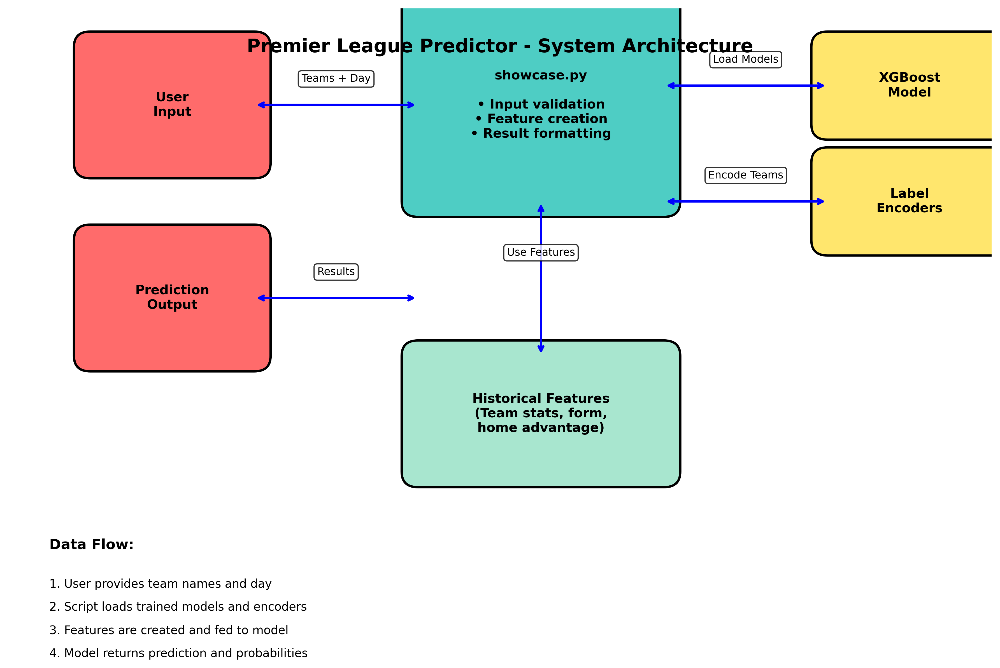

# 🦁⚽ Prem Predicter



<iframe width="560" height="315" src="https://www.youtube.com/embed/88NFpvmHZb8" frameborder="0" allow="accelerometer; autoplay; clipboard-write; encrypted-media; gyroscope; picture-in-picture" allowfullscreen></iframe>

## Author
This program was developed by Venkat Saharsh Pasupuleti for AP CSP summer homework

## Purpose
Attempting to predict Premier League games using pre-match data.

## Results
XGBoost Model with 40% model accuracy

## Installation
Ensure you have Python 3.7 or higher installed on your system.
Install the required packages
```pip install -r requirements.txt```

## Usage
Run the program using
```python sample.py```

When prompted: 
Home Team: Enter the full name of the home team
Example: Manchester City
Use complete official team names (see supported teams below)
Away Team: Enter the full name of the away team
Example: Arsenal
Must be different from the home team
Day of Week: Enter the day abbreviation
Valid options: Mon, Tue, Wed, Thu, Fri, Sat, Sun
Example: Sat

### Supported Teams
The model supports the following Premier League teams:

Arsenal
Aston Villa
Brighton and Hove Albion
Burnley
Chelsea
Crystal Palace
Everton
Fulham
Liverpool
Luton Town
Manchester City
Manchester United
Newcastle United
Nottingham Forest
Sheffield United
Tottenham Hotspur
West Ham United
AFC Bournemouth
Brentford
Wolverhampton Wanderers

### Input Rules
Team names are case-sensitive and must match exactly
Teams must be different (cannot predict a team playing itself)
Day must be a valid 3-letter abbreviation
If a team is not recognized, the program will use default statistics

## Output
Program outputs into terminal the winner and their probabilities for a home win, a draw, or an away win.

Match Information: Confirms the teams and day entered
Prediction: The most likely outcome according to the model
Confidence: The probability of the predicted outcome (higher = more confident)
Probability Breakdown: Shows the likelihood of each possible result
Home Win: Probability the home team wins
Draw: Probability the match ends in a tie
Away Win: Probability the away team wins

## Credits:
Dataset: https://www.kaggle.com/datasets/mertbayraktar/english-premier-league-matches-20232024-season?resource=download

### ⚠️ Warning: Model is not very accurate. Proceed with caution.

